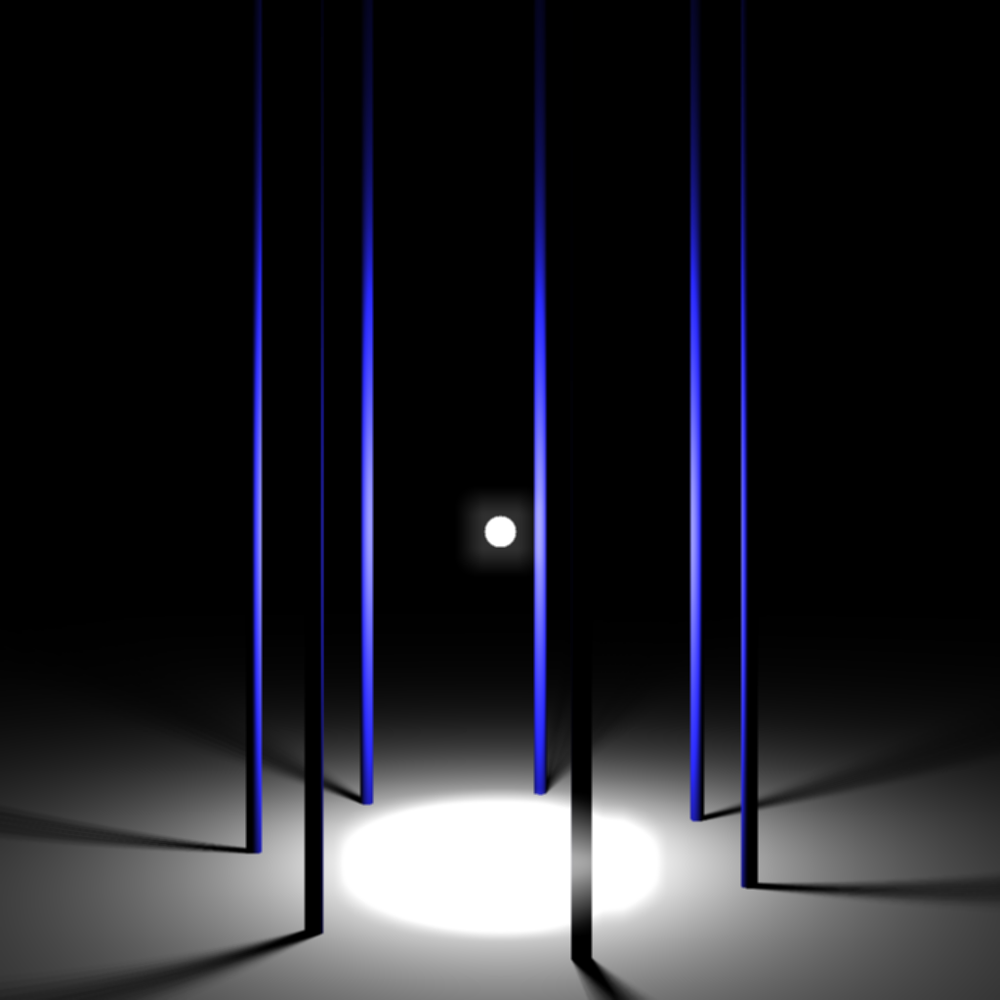
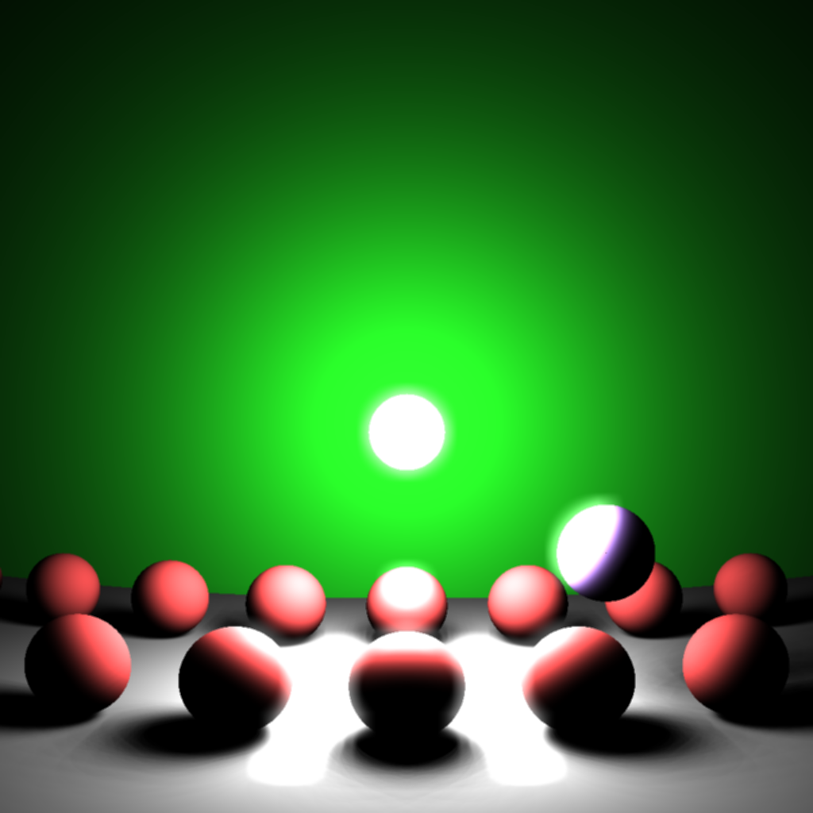
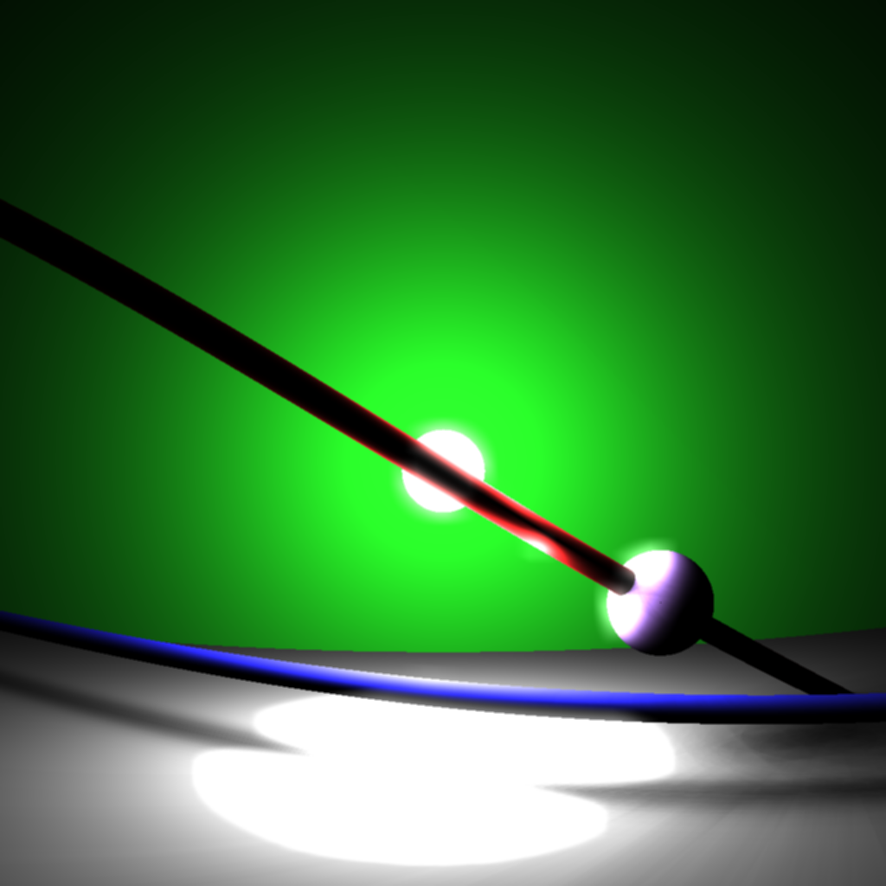
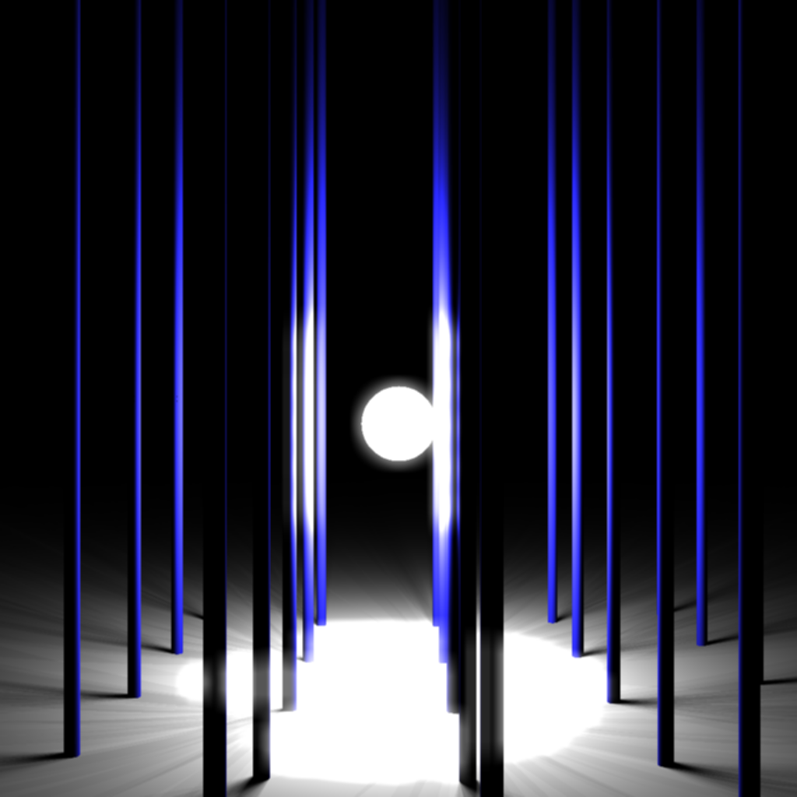
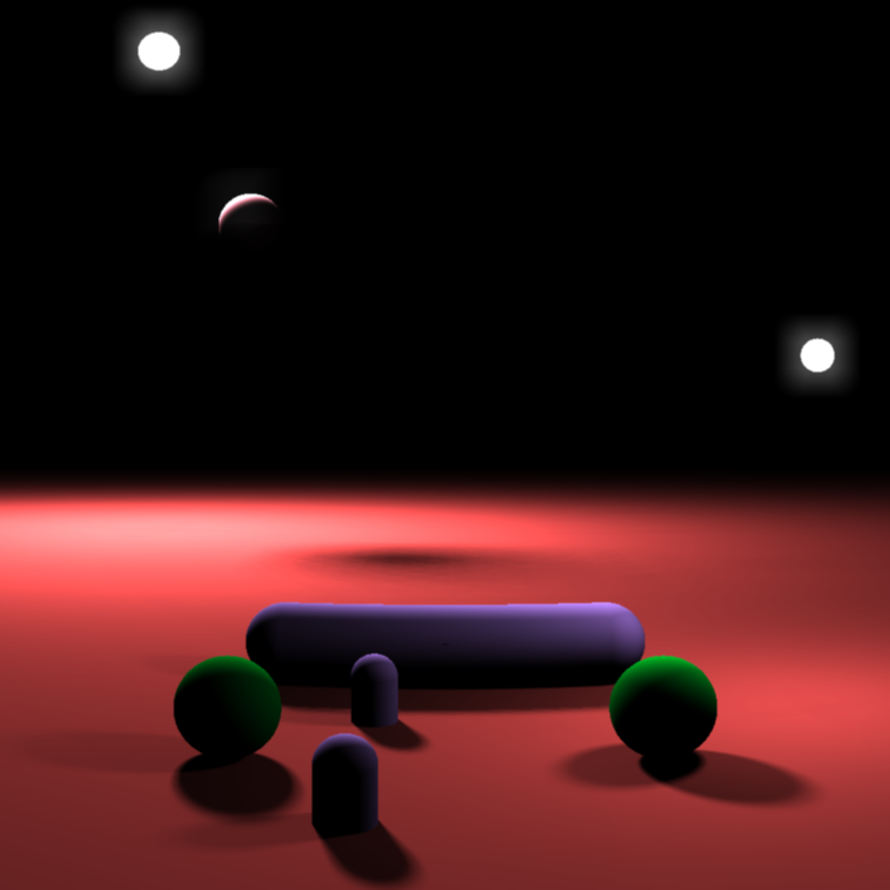
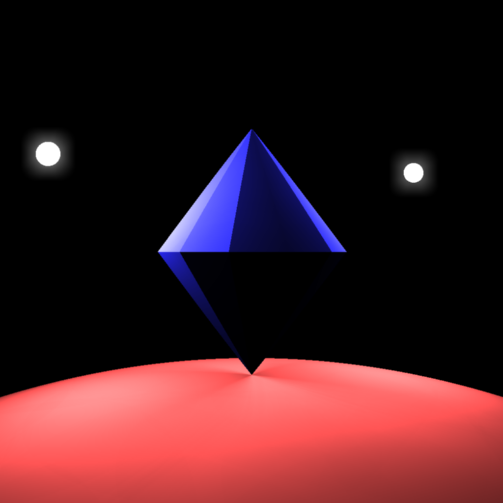

# Bogo-Renderer

CPU-Accelerated 3D renderer fully written in Rust.

This is 100% hobby project. Don't expect anything from it.

## Showcases

## Features

- [X] Soft Shadow
- [X] Glowing
- [ ] Global Illumination
- [X] Light sources
  - [X] Multiple light sources
  - [X] Control brightness
  - [ ] Light sources other than points
- [ ] Reflection
- [ ] Opacity
- [X] Camera
  - [X] Zoom
    - [ ] Remove distortion
  - [X] Move
  - [X] Rotate
- [X] Configurable render pipeline
- [ ] Sky

## Shapes

- [X] Sphere
- [X] (Infinite) Plane
- [X] (Infinite) Cylinder
- [X] Capsule
- [X] Triangle

## Materials

No material-related stuffs, at all.

No textures, no normal mappings. Only single color per an object.

## Imports

You cannot import 3D models from other files. You have to model everything within this crate, using basic shapes.

## Exports

It uses [image](https://github.com/image-rs/image) as its backend. That means it can only export its result to image files.

## Optimizations

It only uses CPUs, because I don't know how to handle GPUs.

It takes full advantage of multicores, thanks to [rayon](https://github.com/rayon-rs/rayon)